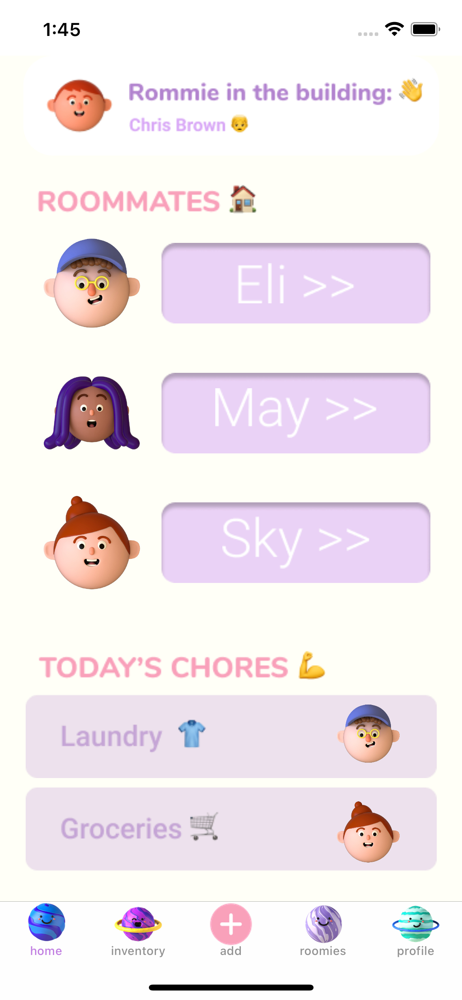
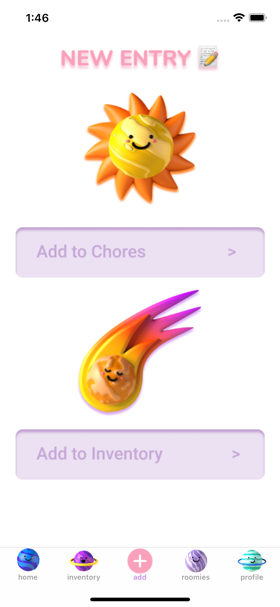
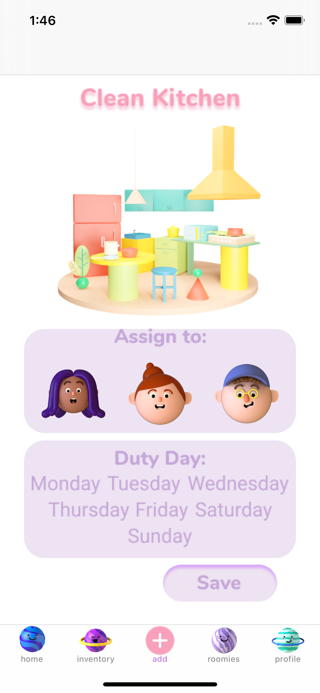
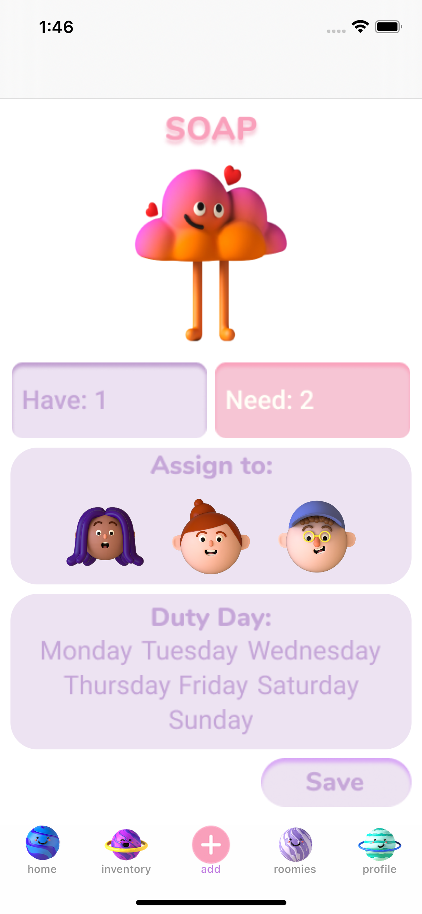
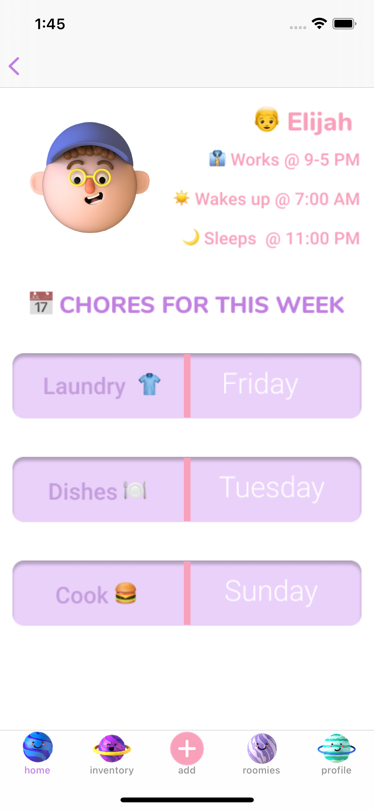

# chore-lite

## 💡 Inspiration

Staying home for almost a year has opened our eyes to how lazy and irresponsible some of our siblings and/or roommates can be. Whether it be among siblings or roommates dividing chores are a hassle as everyone wants an “equal” amount of chores or the “easy" chores. When you delegate roles, people tend to forget and are not held accountable for their assigned chores. They also tend to claim they were never told. It’s hard to keep track of how many toilet paper or trash bags you have and who should restock.

## 💻 What it does

* Delegate chores by head of household or by online generator.
* Holds the roommate/sibling accountable by having a notification sent to the roommate to remind them of their daily chores.
* Monitors household inventory.
* Can delegate roommates/siblings to restock items that are running low or gone.
* [Slideshow Presentation](https://docs.google.com/presentation/d/1jZHP1-VY_3Q425FkpKQbfCBqB5y70GuOgDL8Er_Ir-c/edit#slide=id.p)

## Sample Graphics

    

## 🔨 How we built it

👩‍🎨 **Designing**: We first brainstormed ideas and made a prototype on Figma. 

👩‍💻**Coding**: We then used Swift and XCode to bring our prototype alive.

## 🧠 Challenges we ran into

* Designing a mobile app on Figma, as it was our first time. 🎨
* Finding teammates w/ similar skill sets and ideas. 🕐
* Balancing complexity and simplicity given the time frame 

## 🏅 Accomplishments that we're proud of

* Completing a project that we are truly passionate about and that can help a lot of roommates, siblings, and grown adults.
* Despite our challenges we made a project that we're proud of.

## 📖 What we learned

* How to design and make a prototype on figma.
* How to quickly turn the prototype into a working app.
* The importance of teamwork and communication. 

## 🚀 What's next for _Chore Lite_

* Making a "photo of proof" feature.
* Making an android version.
